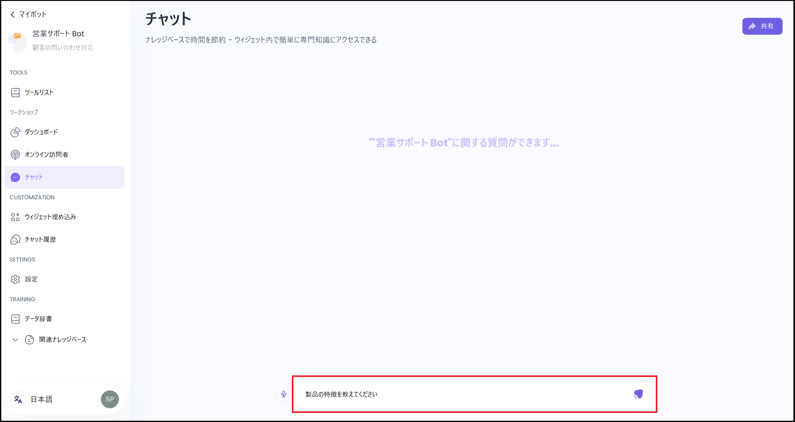

GBaseを素早く利用したい場合は、以下の手順に従ってください。\
短時間でボットを作成し、使用を開始できます。

### 1. AIアシスタントの作成（所要時間：2分）

1. GBaseにログインします。
2. メイン画面で「AIアシスタントを作成」をクリックします。
3. ボットのタイプを選択してください。
   *   Chatbot

       主に、ユーザーとの対話（Q\&A）を通じて情報を提供します。

       * 質問に対し、決められたシナリオやFAQに基づいて応答
       * 主にカスタマーサポートや問い合わせ対応に利用
       * 質問から回答までのレスポンスが、Agentに比べて早い　等
   * Agent\
     主に、ユーザーのリクエストに応じて自律的にアクションを実行します。
     * ユーザーの指示に基づいてタスクを実行
     * 継続的な対話や、状況に応じた意思決定が可能
     * システムやデータベースと連携して、より高度な処理ができる
     * 詳細設定やプロンプトのカスタマイズが可能
     * 質問から回答までのレスポンスが、Chatbotに比べて遅い　等
4. 下記の項目を入力してください。
   * 名前（例：営業サポート Bot 等）
   * 説明（例：営業資料の問い合わせ対応 等）
5. 「OK」をクリックします。

%20(2).png)

### 2. ナレッジベースの登録（所要時間：3分）

1. ウェブサイトは2種類の指定方法があります。
   * 最大で読み込むページ数を指定してください。（初期設定：400ページ）
     \
     ページ数を抑えることで、読み込み速度や応答時間を短縮できます。
   * 単一のウェブページ：指定されたページのみ読み込みます。
2. ウェブサイトのURLを指定します。
   * 例：自社ウェブサイト向けに使用する場合は、自社ウェブサイトのURLを入力します。
   * その他の設定はデフォルトで問題ありません。
3. 「リンクを取得する」をクリックし、ウェブサイトの解析・処理を行います。
4. 解析と処理のプロセスが表示されます。情報量により時間がかかります。
5. 解析と処理が終わりましたら、「OK」をクリックします。

### 3. 動作確認（所要時間：1分）

* チャットウィンドウに質問を入力してください。&#x20;
  * 例：製品の特徴を教えてください

### 4. 便利な機能

* Read-Out機能：音声の読み上げが可能です。
* [アクセス管理](./welcome/access-management)（共同編集）：他のメンバーをボットやナレッジベースに招待することが可能です。

.png)

### 5. 次のステップ

* 以下の方法でナレッジベースに情報を追加できます。
  * PDF/Word等のファイルをドラッグ＆ドロップ
  * Lark文書を連携（Integrations→Larkを選択）
* 自分のWebサイトにボットのウィジェットを埋め込みできます。
* パフォーマンスのモニタリングができます。

### お困りの際は、以下の方法をお試しください。

* **マニュアルで詳細を確認する**
* **サポートチームへ問い合わせる**
* **ホームページのボットに質問する**

***

🔑 ヒント：

* 最初は小規模なナレッジベースから始めることをおすすめします。
* チャットテストを十分に行い、回答の品質を確認してください。
* Agentを使う場合は、必要に応じてプロンプトを調整し、回答の最適化をしてください。
