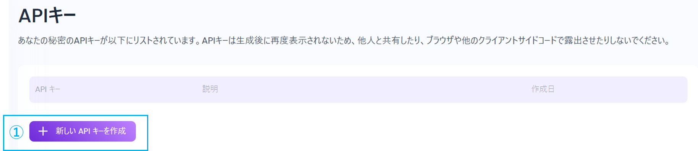
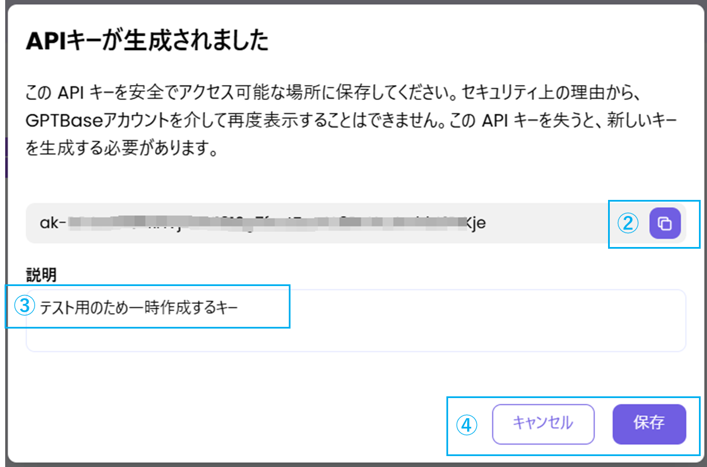
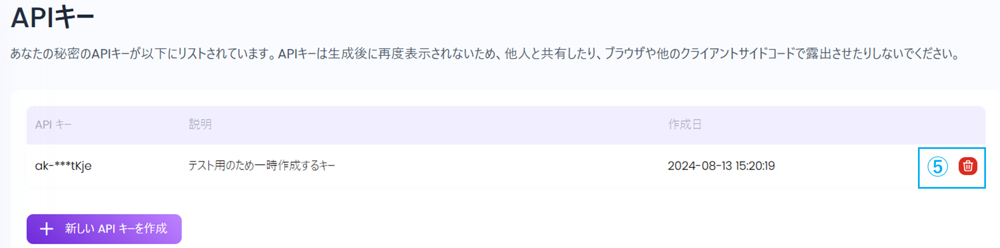
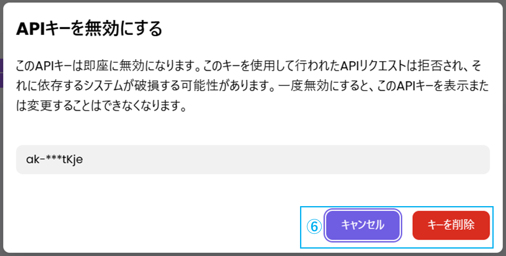

### ①「新しいAPIキーを作成」をクリックし、APIキーを生成します。

### ② 生成したAPIキーをコピーできます。

* セキュリティ上の理由により、再表示することはできません。必ず安全な場所に保管してください。
* APIキーを紛失した場合は、新しいキーを再生成する必要があります。

### ③生成したAPIキーの説明文を入力できます。

### ④生成したAPIキーの保存、もしくはキャンセルができます。

### ⑤APIキーの削除画面へ移動します。

### ⑥APIキーの削除、もしくはキャンセルができます。

