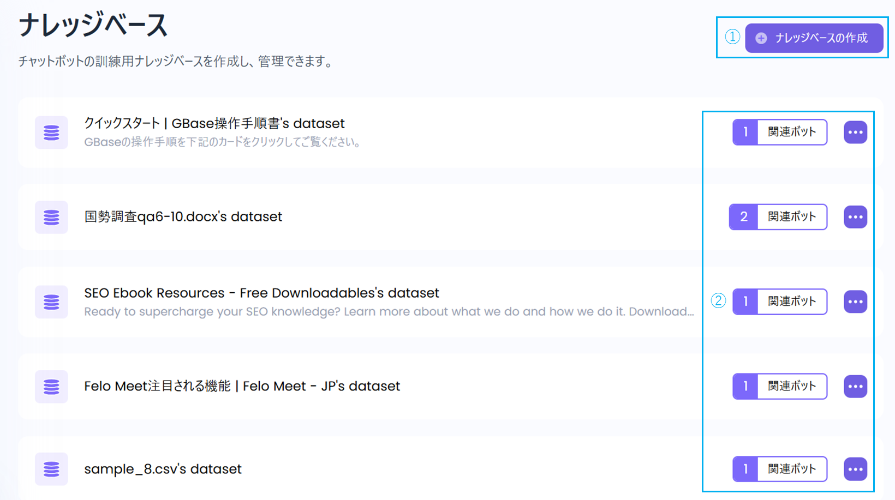
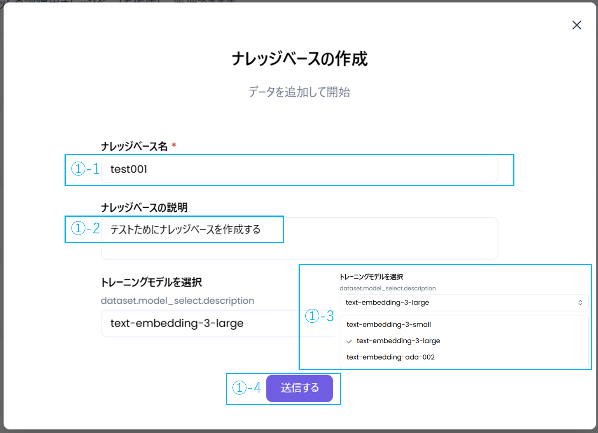
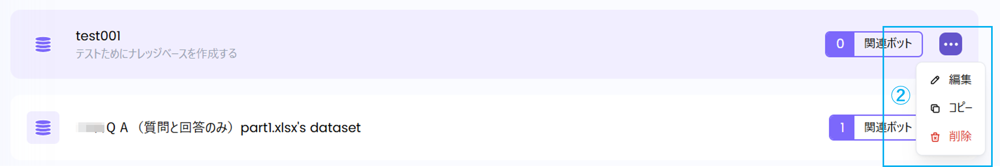
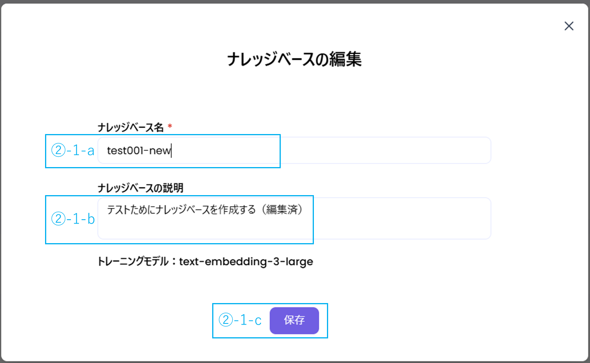
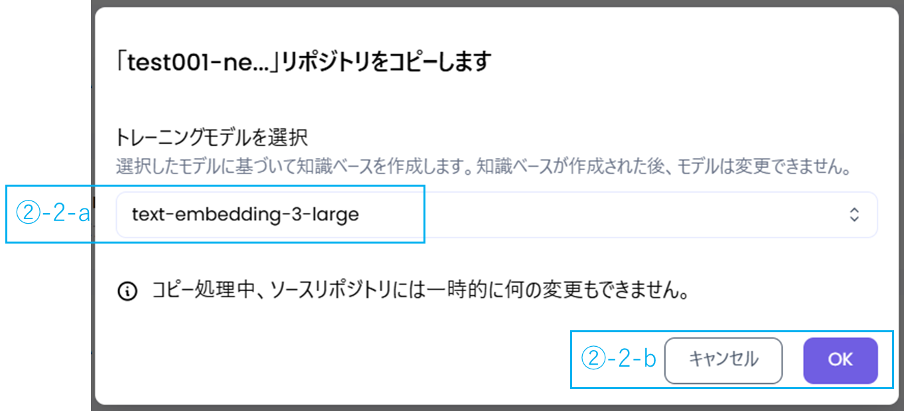
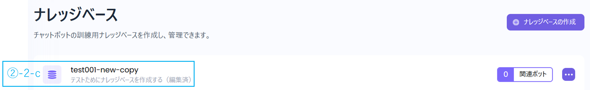
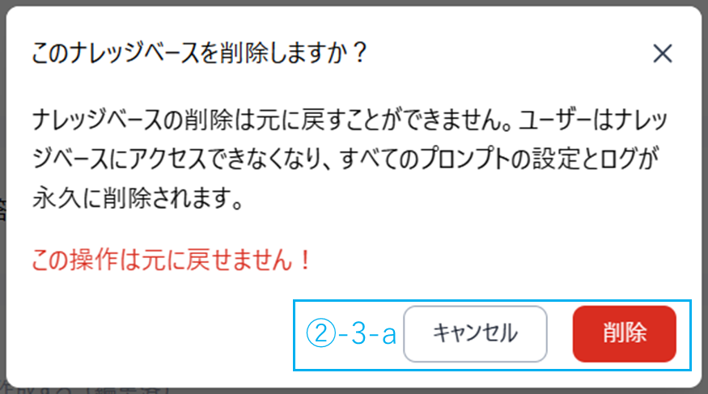
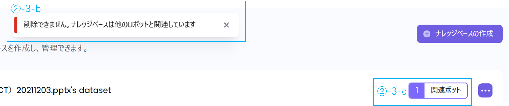

①ナレッジベースを作成できます。

②リンクされたボットの確認、ナレッジベースの編集・コピー・削除ができます。

### 1. ナレッジベースの作成

①-1：ナレッジベース名を入力してください。　**※入力必須**  
①-2：ナレッジベースの説明文を入力してくださいしてください。\
①-3：トレーニングモデルを選択してください。　※初期設定：text-embedding-3-large\
①-4：送信」をクリックし、ナレッジベースを作成します。

②ナレッジベースの関連メニューには「編集」、「コピー」、「削除」の3つの機能があります。

②-1．「編集」ボタンを押すと、ナレッジベースを編集する画面が表示されます。\
　　②-1-a．ナレッジベース名を修正できます\
　　②-1-b．ナレッジベースの説明文も修正できます\
　　②-1-c．「送信」ボタンを押すと、修正内容が保存されます。

②-2．「コピー」ボタンを押すと、ナレッジベースをコピーする画面が表示されます。\
　　②-2-a．コピーの際にトレーニングモデルを変更できます。\
　　②-2-b．「OK」を押すと保存され、「キャンセル」を押すとコピーが取り消されます。\
　　②-2-c．コピー後、ナレッジベース一覧の先頭に表示されます（名称は「XXX_COPY」）。

②-3-a．「削除」ボタンを押すと、ナレッジベースが削除されます。\
　　　　削除したナレッジベースは復旧できません。 「キャンセル」を押すと削除が取り消されます。

②-3-b．「関連ボット」の数がゼロでない場合、「削除」できません。

