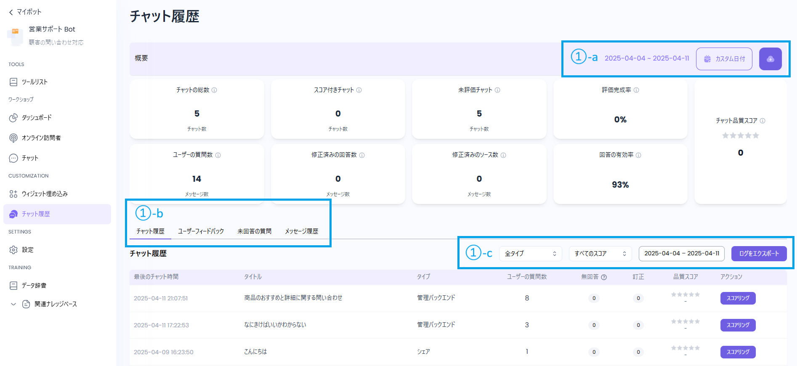
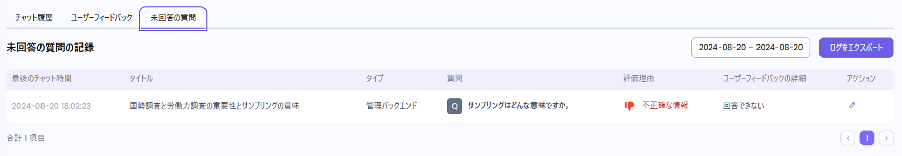
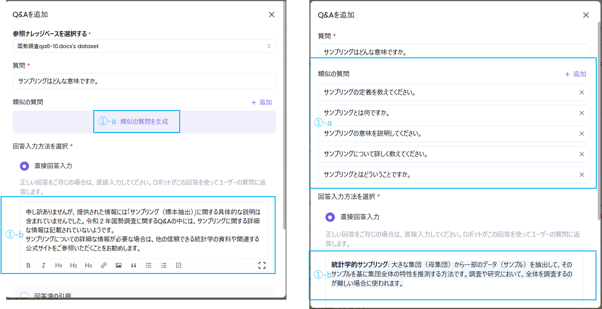
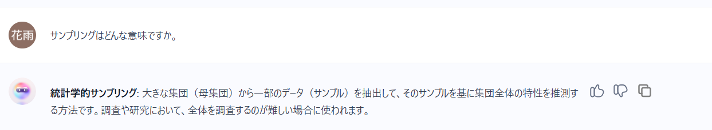

### 1. チャット履歴の確認

①-a：\
表示するチャット履歴の期間を指定してください。\
チャット履歴はcsv形式でダウンロードすることもできます。

①-b：\
チャット履歴は4つのタブから詳細を確認できます。

* チャット履歴：\
  過去のチャットを一覧で確認できます。
* ユーザーフィードバック：\
  ユーザーが回答を評価したQAを表示します。
* 未回答の質問：\
  ボットが回答できなかった質問を表示します。手動で修正・対応可能です。
* メッセージ履歴：\
  過去のチャットとフィードバックを一覧表示し、②メッセージの編集ができます。

①-c：\
各項目や期間での抽出が可能です。抽出結果はcsv形式でダウンロードできます。

.png)

.png)

.png)

### ②メッセージの編集

メッセージを手動で編集できます。回答できなかったメッセージに即時対応することで、ユーザーの満足度を向上させることができます。

①-a：\
類似の質問を自動で生成できます。

①-b：\
正しい回答を直接入力することで、ユーザーの質問に返答することができます。

編集後に再度質問すると、正しい内容で回答します。

