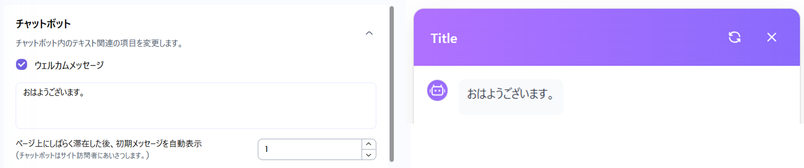
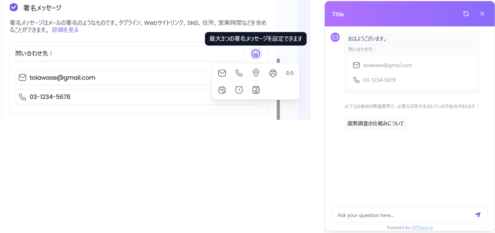
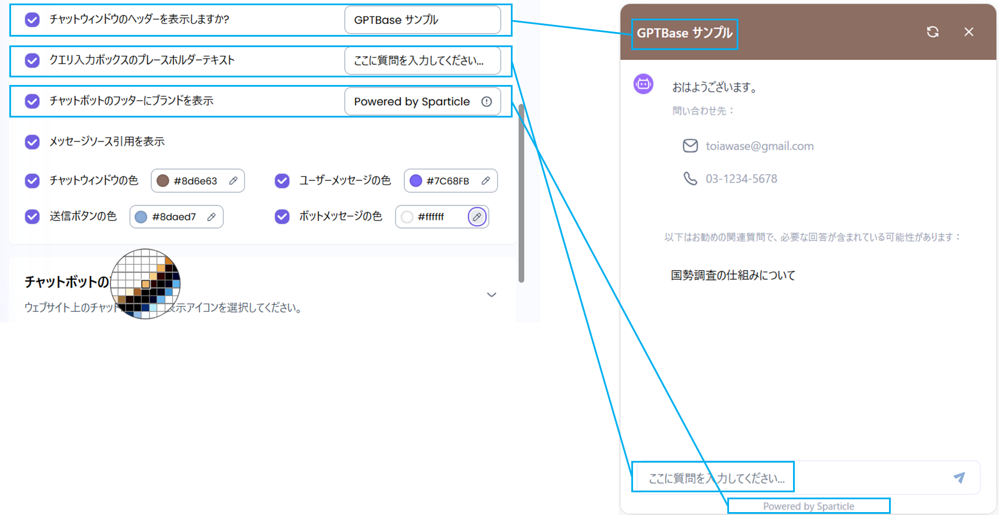
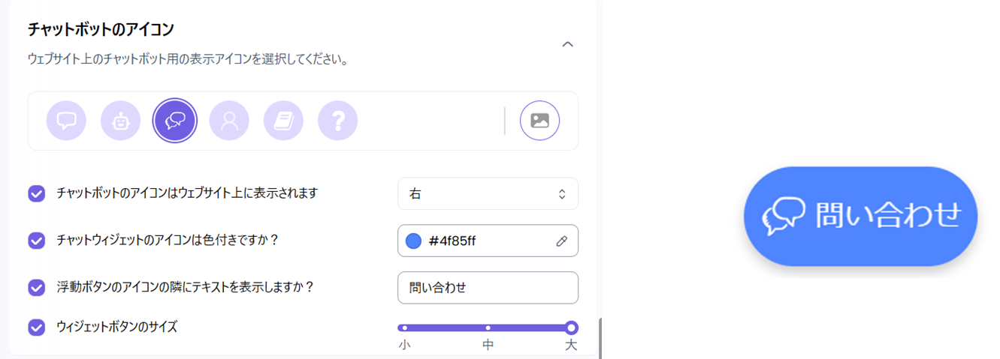
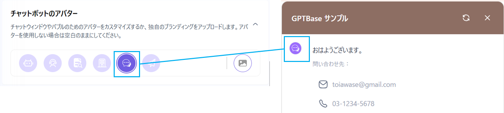
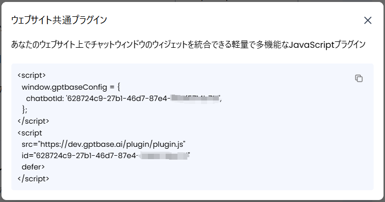

ボットの各種設定や、ウェブサイト埋め込み用のプラグインを確認できます。\
右画面のプレビューで確認しながら、設定を変更することができます。

.png)

### 1. チャットボット

* ウェルカムメッセージ
  * ボットが自動で表示する初期メッセージを設定できます。
  * 多言語（日本語、中国語、英語、韓国語）にも対応しています。
  * ボットのアイコンをクリックしなかった場合、初期メッセージを自動でアイコン上に表示します。\
    初期メッセージが表示されるまでの秒数を設定できます。

.png)

* 推奨メッセージ（対話インターフェースで使用するコンテンツの設定）
  *   画面上に表示する「よくある質問」や「案内メッセージ」を事前に設定することができます。

      設定した質問は一覧で表示され、ユーザーがクリックするだけで、自動的に質問を送信します。
  * Q&Aツリーとしてナレッジベースを参照し、質問内容を紐付けることもできます。

%20(1).png)

* 署名メッセージ
  * 署名として表示するメッセージを設定できます。
  * メッセージの他に、以下8項目の中から最大3項目を選択し、表示することができます。\
    「メール」　「連絡先」　「住所」　「FAX番号」　「リンク」　「日付」　「時間」　「テキスト」

* 各種設定
  * ヘッダーとフッターを設定できます。
  * クエリ入力ボックスに表示するプレースホルダーのテキストを設定できます。
  * ボット上部のカラーと、送信ボタンのカラーを設定できます。

### 2. チャットボットのアイコン

* ウェブサイトに表示するボットアイコンをカスタマイズできます。
  * アイコンに表示するイラストを設定できます。画像をアップロードして使用することもできます。
  * アイコンを表示する位置を設定できます。　※初期設定：右下
  * アイコンのカラーと表示テキストを設定できます。
  * アイコンの大きさを設定できます。　※初期設定：小

### 3. チャットボットのアバター

* ボット側のアイコンをカスタマイズできます。
  * アイコンに表示するイラストを設定できます。画像をアップロードして使用することもできます。

### 4. ウェブサイトに埋め込む

* JavaScriptプラグインが表示されます。
  * HTMLに追加することで、ウェブサイト上にボットを埋め込むことができます。

### 5. プレビュー

* ウェブサイト上にボットを埋め込んだ状態を確認することができます。

.png)
