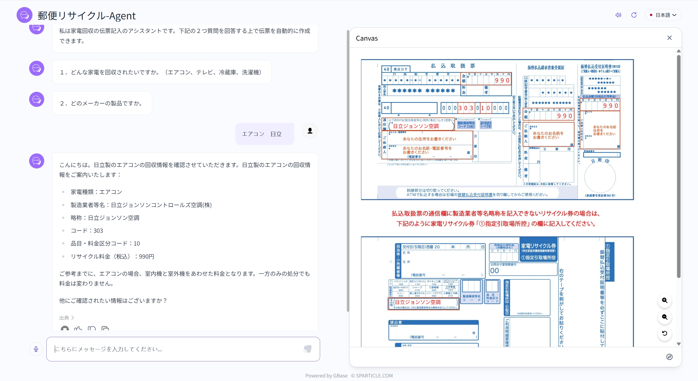
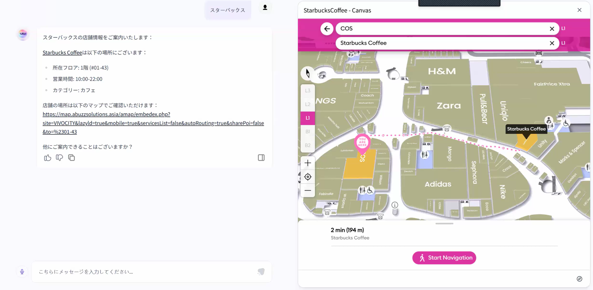
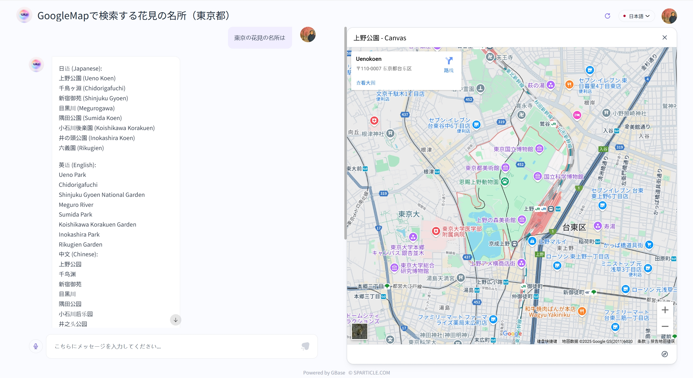

Canvasは高い表示自由度を持っており、柔軟なカスタマイズが可能です。
情報の見せ方を最適化することで、ユーザーにとって分かりやすく、効果的な案内が実現できます。

**※Canvas機能のご利用はオプションとなるため、詳細はお問い合わせください。**

**例：帳票テンプレートに情報を反映して表示**

**例：APIが返す店舗名称やフロア情報に応じて、現在地に合わせた店舗地図を表示**

**例：Googleマップや独自に開発した表示機能の呼び出し**
