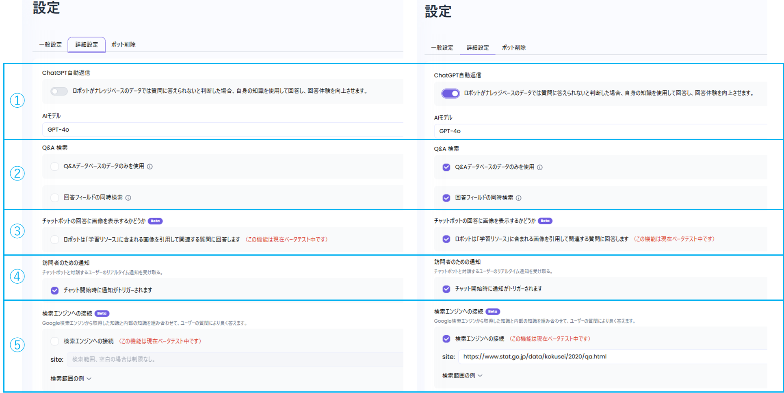

下記11項目を設定することで、ボットの回答を細かく調整できます。

### ①ChatGPT自動返信：

* ナレッジベースの情報では答えられない場合、AIモデルを利用して回答します。
* AIモデルを指定することができます。

### ②QA検索：

* Q&Aデータベースの情報を使用できます。
* 回答フィールドの同時検索ができます。

### ③ボットの回答に画像を表示

* 学習リソースに含まれる画像を利用して、回答に画像を含めます。
* こちらの機能はベータテスト中です。

### ④訪問者のための通知

* チャット開始時にユーザーへ通知します。

### ⑤検索エンジンへの接続

* 指定した検索エンジンから取得した情報と内部のナレッジベースを組み合わせて、ユーザーの質問に対してより適切に回答します。
* こちらの機能はベータテスト中です。

### ⑥メッセージクオータ

* メッセージ数の上限と、適用期間を設定できます。

### ⑦口調・創造性

* 口調は、利用シーンに応じて使い分けることができます。
* 創造性は、数値が高いほど想像力豊かで多様な回答になり、低いほど正確で安定した回答になります。

### ⑧答えられないときの応答

* 質問に答えられない場合の返答メッセージを設定できます。

### ⑨お問い合わせ

* Googleフォームを利用して、問い合わせに対応できます。

### ⑩Read-Out機能

* ボットの回答を音声で読み上げます。

### ⑪2Dデジタルヒューマン

* ウィジェット内で2Dデジタルヒューマンを利用できます。
* こちらの機能はベータテスト中です。

