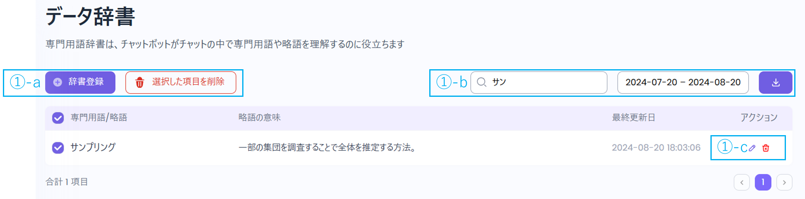
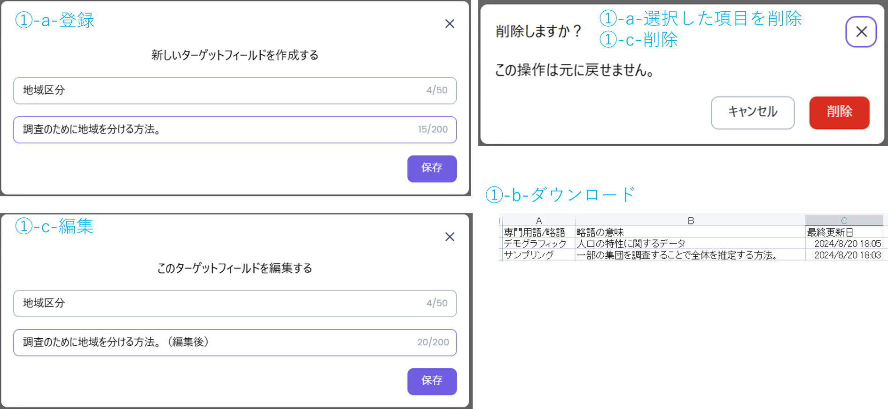

データ辞書に登録することで、ボットが専門用語や略語を理解しやすくなります。

.png)

* ①-a：
  * 辞書登録：専門用語／略語を1件ずつ登録できます。
  * 選択した項目を削除：選択した専門用語／略語を削除できます。
* ①-b：
  * 専門用語を検索：専門用語／略語からキーワードによる検索ができます。
  * 日付指定：最終更新日が指定した期間内にある専門用語／略語を検索できます。
  * ダウンロード：現在表示されている専門用語／略語をCSV形式でダウンロードできます。
* ①-c：
  * 編集：専門用語／略語の内容を修正できます。
  * 削除：専門用語／略語を削除できます。　**※削除後は元に戻せません**

