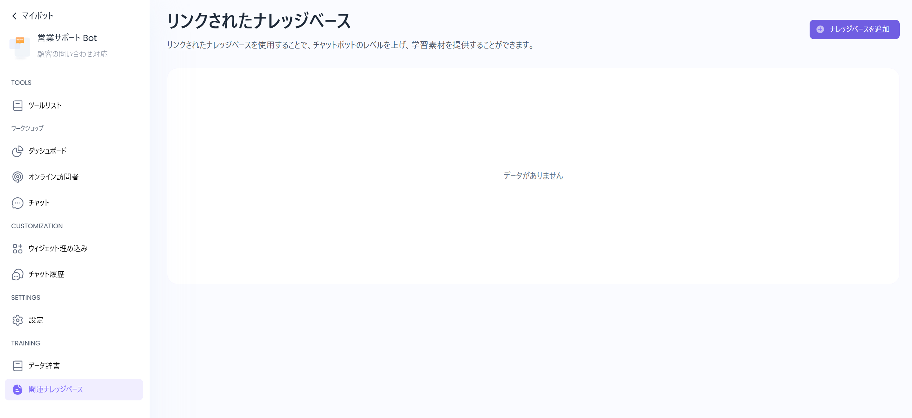

ボットにナレッジベースをリンクさせることができます。

* ①-a：サイドメニューの「＋」、もしくは右上の「ナレッジベースを追加」をクリックしてください。
* ①-b：ボットとリンクしたいナレッジベースを選択してください。
* ①-c：リンクしたいナレッジベースの追加、もしくはキャンセルができます。

* ②-a：リンクしたナレッジベースは、サイドメニューでも確認できます。
* ②-b：リンクしたナレッジベースのコピーと削除ができます。
  * コピー：コピーする際に、トレーニングモデルの変更もできます。
  * 削除：ナレッジベースとのリンクを解除します。ナレッジベース自体は削除されません。

ナレッジベースの詳細画面では、学習済みコンテンツのフィルタリング、状態の確認、再学習などの操作ができます。

* ③-a：「リソース」や「タイトル」をキーワードで検索できます。
* ③-b：ステータス別にコンテンツを抽出できます。
* ③-c：最終更新日が指定された範囲内のコンテンツを抽出できます。
* ③-d：選択したコンテンツを再学習させることができます。　**※複数選択可能**
* ③-e：「選択した項目を削除」は、選択したコンテンツを一括削除できます。
* ③-f：各コンテンツごとに、以下のサブメニュー機能を使用できます。
  * ③-f-1　編集：コンテンツのタイトルを編集できます。
  * ~~③-f-2　データブロックを表示：~~　**※この機能は現在ご利用いただけません。**
  * ③-f-3　再学習：該当データを再学習できます。　**※ステータスが「学習中」に変わります**
  * ③-f-4　検索データチャンク：学習データを項目ごとに区切った形式で確認できます。

