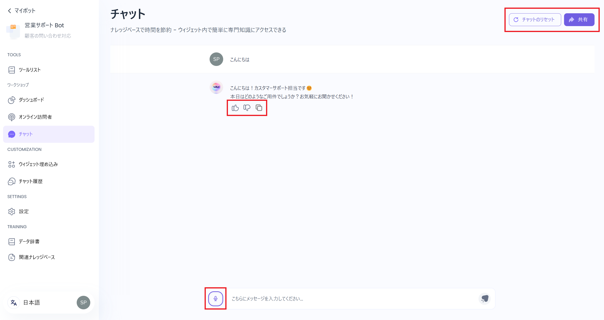

### 1. 管理者画面

チャットウィンドウでボットに質問することで、ボットの動作を確認できます。

* マイクのアイコンをクリックすると、音声入力形式に切り替えができます。
* ボットからの返答に対し、評価とフィードバックができます。
* 「共有」は、ボットへのアクセスリンクのコピーや、アクセス権限の設定ができます。\
  リンクを共有することで、管理者以外のユーザーもボットを利用できるようになります。
  * 全てのユーザーがアクセス可能：\
    リンクを知っているユーザー全員がアクセスできます。
  * 招待ユーザーのみアクセス可能：\
    アクセスできるユーザーを指定できますが、ウェブサイトのウィジェットが機能しません。
* 「チャットのリセット」は、現在の会話を終了し、新しくチャットを開始できます。\
  なお、[チャット履歴](../customize/chat-history)は消去されません。

### 2. 一般ユーザー画面

管理者から共有されたリンクにアクセスすると、こちらの画面が表示されます。

* マイクのアイコンをクリックすると、音声入力形式に切り替えができます。
* ボットからの返答に対し、評価とフィードバックができます。
* 画面右上の項目から、言語設定と会話のリセットができます。

.png)
